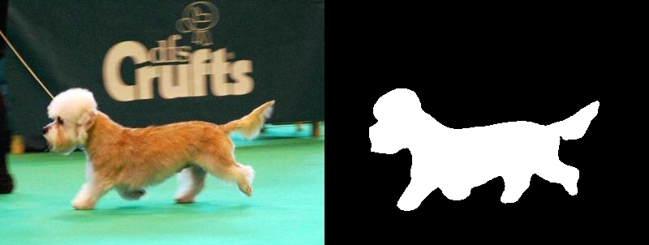

Quantization Aware Training Implementation of [CTDNet](https://dl.acm.org/doi/abs/10.1145/3474085.3475494)

### Installation

```
conda create -n PyTorch python=3.11
conda activate PyTorch
conda install pytorch torchvision torchaudio pytorch-cuda=11.8 -c pytorch -c nvidia
pip install opencv-python==4.5.5.64
pip install tqdm
pip install timm
```

### Train

* Configure your dataset path in `main.py` for training
* Run `python main.py --train` for training

### Test

* Configure your dataset path in `main.py` for testing
* Run `python main.py --test` for testing

### Demo

* Configure your image path in `main.py` for visualizing the demo
* Run `python main.py --demo` for demo

### Results



